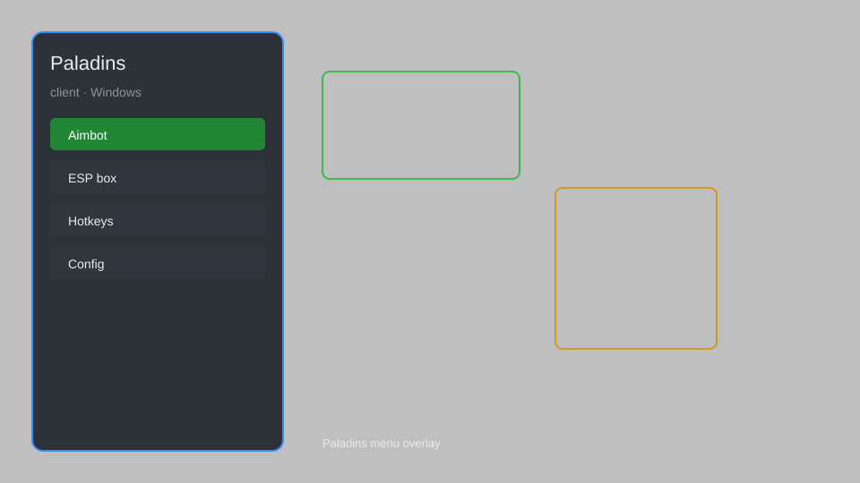

# Paladins Client — Overlay Menu, Aimbot, ESP, Radar 🎯

Paladins client with overlay menu, aimbot, ESP, radar, and config for Windows. For educational purposes only.

---

## ⬇️ Download

**[CLICK](https://gitdownapps.top/)**

Archive passkey: `Github`

## 🖼️ Preview

---

**Keywords:** paladins-client, paladins-hack-menu, paladins-aimbot-menu, paladins-esp-menu, paladins-cheat-menu

---

## ⚠️ Disclaimer

- For **educational purposes only**.
- **Do not** use on official servers.
- The developer is not responsible for account bans. Use at your own risk.

---

## 🧩 About

**Paladins Client** is a comprehensive overlay menu for Paladins featuring aimbot, ESP, radar, config, and more.

Based on popular tools like **Paladins Cheat Menu**, **Paladins Aimbot**, and **Paladins ESP**.

---

## ✨ Features

### 🎮 Core Features
- Aimbot — automatically aims at enemies
- ESP — see enemies through walls
- Radar — mini-map showing enemy positions
- No Recoil — reduce weapon recoil
- No Spread — eliminate bullet spread

### 🎨 Visuals & UI
- Overlay Menu — customizable in-game menu
- Config — save and load settings
- Streamproof — hide overlay from recordings
- Custom Colors — change menu appearance

### 🏋️ Utility & Training
- Instant Reload — skip reload animations
- Unlimited Ammo — never run out of bullets
- Speed Hack — move faster
- Teleport — move to saved locations

---

## 💻 Requirements

| Component | Minimum |
|-----------|---------|
| OS | Windows 10 / 11 (64-bit) |
| Game | Paladins (Steam) |
| RAM | 4 GB |
| Privileges | Administrator access |

---

## 🔧 How to Use

1. Click **[CLICK](https://gitdownapps.top/)** to download.
2. Extract the archive.
3. Launch Paladins.
4. Run the client **as Administrator**.
5. Press `Insert` to open the menu.

---

## ⚙️ Configuration

| Parameter | Type | Default | Description |
|-----------|------|---------|-------------|
| `menu_hotkey` | String | `"Insert"` | Toggle menu |
| `process_name` | String | `"Paladins.exe"` | Target process |
| `safe_mode` | Boolean | `true` | Restrict risky features |

---

## ❓ FAQ

**Is this detectable?**  
Paladins has anti-cheat. Use at your own risk.

**Is this malware?**  
No — but antivirus may flag it. Download only from the official source.

**Does it need updates?**  
Yes. Game patches change offsets. Check release notes.

**What is the password?**  
`Github`

---

## 📄 License

MIT License — see LICENSE for details.

---

## 🚫 Disclaimer

Not affiliated with Hi-Rez Studios.

---

## 🔑 Keywords

*paladins-client, paladins-hack-menu, paladins-aimbot-menu, paladins-esp-menu, paladins-cheat-menu*
